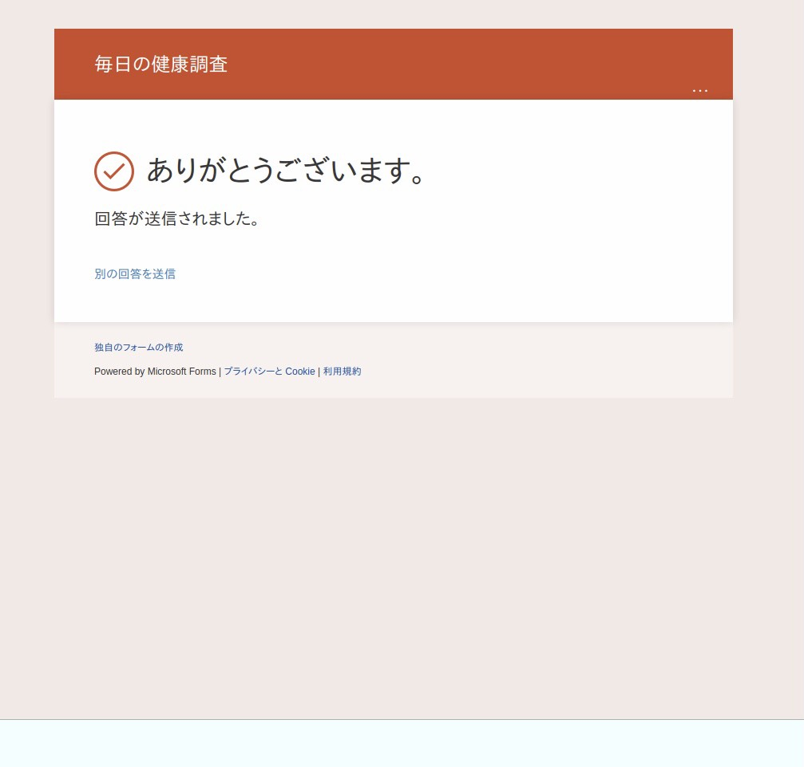

# AutoHealthBot

## Screenshot

## Prerequisites

OS: Arch Linux  
Python3.9.5

## Usage

1. Clone this repository.
2. Run `pip install -r requirements.txt` to install Python package
3. Set your Microsoft (365) account email to MICROSOFT_EMAIL, your password to MICROSOFT_PASSWORD secrets.
4. Run `python src/main.py` to start the AutoHealthBot!
